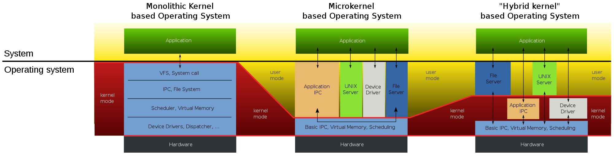

|Nombre| Carnet|
|--|--|
|Andre Joaquin Ortega De Paz|201900597|

# Actividad 1

# Tipos de Kernel y sus diferencias

## Tipos de kernel:
### _1. Kernel Monolítico:_
El kernel monolítico es el tipo más antiguo y simple de kernel. En este enfoque, todas las funciones y servicios del sistema operativo se ejecutan en un solo espacio de memoria y en modo privilegiado. Esto significa que todos los controladores de dispositivos, la gestión de memoria, el sistema de archivos y otros componentes están incluidos en un único núcleo ejecutable. Las ventajas del kernel monolítico incluyen un alto rendimiento y una baja latencia, ya que no hay gastos generales de comunicación entre módulos. Sin embargo, una desventaja es que un error en cualquier componente puede afectar todo el sistema. Los sistemas operativos que usan el kernel monolítico son Linux, OS X y Windows.

### _2. Microkernel:_
El microkernel adopta un enfoque minimalista al trasladar la mayoría de los servicios y procesos del sistema operativo fuera del kernel principal. En su lugar, solo se implementan las funciones esenciales, como la gestión de memoria y la comunicación entre procesos. El resto de los servicios se ejecutan en el espacio del usuario, lo que proporciona un entorno más seguro y robusto. La ventaja clave del microkernel es su alta modularidad, lo que facilita la extensibilidad y el mantenimiento del sistema. Sin embargo, debido a que las interacciones entre módulos se realizan a través de mensajes, puede haber una pérdida de rendimiento comparado con el kernel monolítico. Como ejemplo de aplicación solo existe el componente Mach de OS X, ya que hasta ahora no hay ningún sistema operativo con microkernel.

### _3. Kernel Hibrido:_
El kernel híbrido busca combinar características del kernel monolítico y del microkernel. En este enfoque, algunas funciones cruciales permanecen en el espacio del kernel, mientras que otras se ejecutan en el espacio del usuario como procesos. Esto permite un mejor equilibrio entre el rendimiento y la modularidad. Un ejemplo de un kernel híbrido es el kernel de Windows, que proporciona una capa de abstracción llamada Executive que maneja ciertos servicios en modo kernel, mientras que otros componentes se ejecutan en modo usuario. Esto ya ocurre en cierta medida en Linux y OS X.

## Diferencias de kernel

|kernel monolitico| Microkernel| Kernel híbrido|
|--|--|--|
Portabilidad | El hardware es más abstracto a través de controladores |Incluyen código extra con el objetivo de mejorar el rendimiento.
Pequeña huella de la memoria |Hardware puede reaccionar más lento porque los controladores están en modo usuario |Los controladores de dispositivos y las extensiones al sistema operativo se pueden cargar y descargar fácilmente como módulos, mientras el sistema continúa funcionando sin interrupciones.
Son fáciles de construir, probar e implementar| Los procesos tienen que esperar en una cola para obtener información |Los controladores pueden ser prevolcados (detenidos momentáneamente por actividades más importantes) bajo ciertas condiciones.
|El rendimiento de los componentes suelen compartir memoria, que es más rápida que las comunicaciones de servicio a servicio mediante IPC u otros mecanismos.|Los Procesos no pueden tener acceso a otros procesos sin tener que esperar|La mayoría de los Sistemas Operativos modernos contienen un Núcleo Híbrido|

# User vs. Kernel Mode
|Criterios|Kernel Mode|User Mode|
|--|--|--|
Modo Kernel vs Modo Usuario|El programa tiene acceso directo y sin restricciones a los recursos del sistema.|El programa de aplicación se ejecuta y se inicia.
|Interrupciones|Todo el sistema operativo puede dejar de funcionar si se produce una interrupción|un solo proceso falla si ocurre una interrupción. |
Modos| También se conoce como modo maestro, modo privilegiado o modo de sistema.|	El modo de usuario también se conoce como modo sin privilegios, modo restringido o modo esclavo.|
Espacio de direcciones virtuales|Todos los procesos comparten un único espacio de direcciones virtuales.|todos los procesos obtienen un espacio de direcciones virtuales separado.|
|Nivel de privilegio|Las aplicaciones tienen más privilegios que en el modo usuario.|Las aplicaciones tienen menos privilegios.|
Restricciones|Como  puede acceder tanto a los programas del usuario como a los programas del kernel, no hay restricciones.|Mientras que el modo de usuario necesita acceder a los programas del kernel, ya que no puede acceder a ellos directamente.|
Valor de bit de modo|El bit de modo de kernel-mode es 0.|El bit de modo del modo de usuario es 1.|
Referencias de memoria	|Es capaz de hacer referencia a ambas áreas de memoria.	|Solo puede hacer referencias a la memoria asignada para el modo de usuario.|
Fallo del sistema| Un bloqueo del sistema en modo kernel es grave y complica las cosas.|Se puede recuperar un bloqueo del sistema simplemente reanudando la sesión.|
Acceso	|Solo la funcionalidad esencial puede operar en este modo.	|Los programas de usuario pueden acceder y ejecutarse en este modo para un sistema determinado.|
Funcionalidad	| Puede hacer referencia a cualquier bloque de memoria en el sistema y también puede dirigir la CPU para la ejecución de una instrucción, lo que lo convierte en un modo muy potente y significativo.|	El modo usuario es un modo de visualización estándar y típico, lo que implica que la información no puede ejecutarse por sí sola ni hacer referencia a ningún bloque de memoria; necesita una interfaz de protocolo de aplicación (API) para lograr estas cosas.|

# Interruptions vs traps
|Trampa|Interrupcion|
|--|--|
La trampa es una señal generada por un programa de usuario que indica al sistema operativo que realice alguna funcionalidad inmediatamente.| La interrupción es una señal a la CPU emitida por hardware que indica un evento que requiere atención inmediata.
|Es un proceso sincrónico.	|Es un proceso asincrónico.|
|Todas las trampas son interrumpidas.|	No todas las interrupciones son trampas.|
|Puede ocurrir sólo desde los dispositivos de software.	|Puede ocurrir desde los dispositivos de hardware y software.|
|Una instrucción del programa de usuario lo genera.|	Los dispositivos de hardware lo generan.|
|También se conoce como interrupción de software.	|También se conoce como interrupción de hardware.|
|Ejecuta la funcionalidad específica en el sistema operativo y otorga control al controlador de trampas.|	Obliga a la CPU a activar una rutina de manejo de interrupciones específica.|